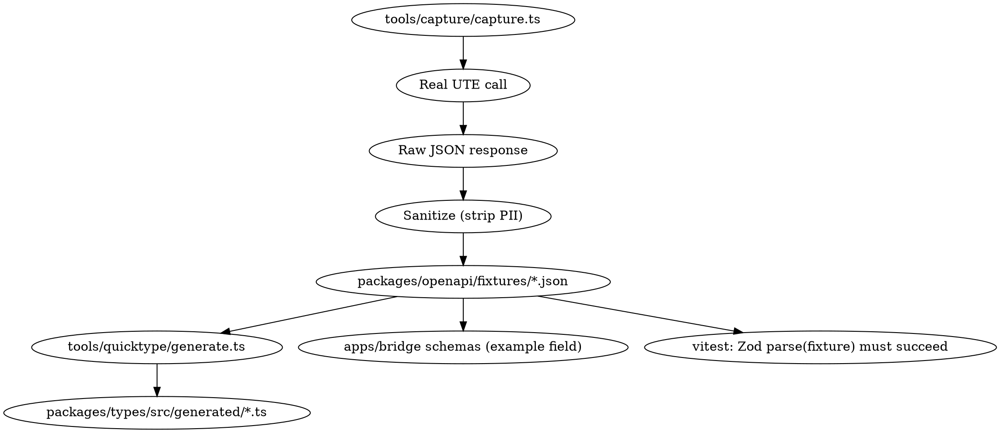

# UTE Mueve Bridge API + SDK — Design

**Date**: 2026-05-20
**Author**: Claude (Opus 4.7)
**Status**: Draft for approval

## 1. Goal

Expose the internal `https://movilidadelectrica.ute.com.uy/api/v2` API (UTE Mueve Flutter app backend) as:

1. A **TypeScript bridge API** deployable to Vercel, that handles UTE's anonymous token flow internally (acquire, cache, refresh on expiry/401).
2. A **TypeScript SDK** (`@ute-mueve/sdk`) that gives idiomatic, typed access to the bridge.
3. **OpenAPI spec** rendered as **Scalar** docs at `/docs`, with real (anonymized) JSON examples.
4. **Strict TypeScript types** generated/verified via **quicktype** against real captured responses.

## 2. Non-goals (v1)

- Mercado Pago payment flow (`v1/card_tokens`) — too sensitive; users registered through UTE's official app.
- IdentityServer OAuth user flow (`identityserver.ute.com.uy/connect/*`) — the public APK uses anonymous client + per-user `userId` already; OAuth flow is for human login in another path.
- Gift card apply (`/api/v2/giftCard/apply`) — financial side effects.
- Notification register (FCM token) — device-specific, low signal for an SDK.
- User register (`/api/v2/user/register`) — administrative.

These are documented in OpenAPI but not implemented in v1.

## 3. Reverse-engineering evidence

Strings extracted from `apk-extracted/lib/arm64-v8a/libapp.so` (Flutter AOT) confirm the endpoint surface. Token shape decoded from captured JWT: `iss=identityserver.ute.com.uy`, `aud=apiME`, `client_id=cargaME`, `scope=[apiME]`, lifetime 3600s (RS256). Anonymous flow: `POST /api/v2/token` body `{clientIdIDP:"cargaME", identifier:"Anonymous"}` with header `uniquekeyuser: <12-hex-chars>` (device-stable identifier; the bridge uses a single deployment-wide value).

## 4. Architecture

### 4.1 Monorepo layout (pnpm workspaces)

```
ute-mueve/
├── apps/bridge/                # Vercel deployment
├── packages/sdk/               # @ute-mueve/sdk (publishable npm)
├── packages/types/             # @ute-mueve/types (Zod schemas + quicktype generated)
├── packages/openapi/           # openapi.yaml + fixtures
├── packages/config/            # shared tsconfig/biome presets
├── tools/capture/              # fixture capture script (manual run)
└── tools/quicktype/            # regenerate types from fixtures
```

### 4.2 Bridge API stack

- **Runtime**: Node 20 (Vercel Functions, Node runtime — not Edge, to support `jose` for JWT decode without Web Crypto polyfills).
- **HTTP**: Hono v4 + `@hono/zod-openapi` (single source of truth: Zod schemas → OpenAPI doc + runtime validation + TS types).
- **Docs**: `@scalar/hono-api-reference` mounted at `/docs`. OpenAPI JSON at `/openapi.json`.
- **Token cache**: Upstash Redis (`@upstash/redis`), key `ute:token:v1`, TTL `expires_in - 60s`. In-memory fallback when env vars absent (dev).
- **Single-flight**: cache miss → mutex (Promise dedupe) so concurrent requests trigger one upstream `POST /token`.
- **401 handling**: invalidate cache + retry once. Second 401 → bubble up as `UteApiError{code:'UPSTREAM_AUTH'}`.
- **Logging**: Pino (`pino-pretty` in dev). Vercel sink in prod.
- **Validation**: every path/body/query parsed by Zod; failures → 400 with structured error.

### 4.3 SDK package

- **Module**: ESM + CJS dual via `tsup`. `.d.ts` shipped.
- **Runtime deps**: zero (uses global `fetch`). Optional peer: `zod` if user wants runtime validation.
- **Public API**: `new UteMueveClient({ baseUrl, apiKey? })`, methods grouped by resource:
  - `client.configuration.appVersion()`
  - `client.stations.filtered(filters)` — accepts ergonomic shape, internally maps to UTE's verbose `{id, internalCode, text, selected, icon}` objects.
  - `client.stations.statusById(id)`
  - `client.stations.renewableEnergy({ start, end, cardNumbers? })`
  - `client.stations.chargeInfo(opts)`
  - `client.stations.cardsChargesCSV(opts)`
  - `client.customer.cards(userId)`
  - `client.customer.registerCard(userId, payload)` *(write, gated)*
  - `client.customer.unregisterCard(userId, payload)` *(write, gated)*
  - `client.card.detail(userId)`
  - `client.network.get(userId)`
  - `client.remoteCharge.history(userId)`
  - `client.remoteCharge.start(opts)` *(write, gated)*
  - `client.remoteCharge.stop(opts)` *(write, gated)*
  - `client.remoteCharge.connectorStatus(opts)`
  - `client.remoteCharge.transaction(id)`
- **Errors**: `UteApiError` extends `Error` with `status`, `code`, `upstream?`, `details?`.
- **Tree-shakeable**: each resource module imports nothing from others.

### 4.4 Types package

- **Source of truth**: hand-written Zod schemas in `packages/types/src/manual/`. These drive both OpenAPI and runtime validation.
- **Verification**: `tools/quicktype/generate.ts` runs `quicktype-core` over `packages/openapi/fixtures/*.json` → `packages/types/src/generated/`. A vitest compares: every Zod schema must parse its corresponding fixture without errors; the generated quicktype interface must be structurally compatible.
- **Why both**: Zod gives runtime guarantees + OpenAPI emission; quicktype gives an independent "second opinion" pinned to real responses so drift gets caught.

### 4.5 OpenAPI / Scalar

- OpenAPI 3.1 spec generated at runtime by `@hono/zod-openapi` from the Zod schemas attached to each route.
- `/docs` serves Scalar UI consuming `/openapi.json`.
- Each endpoint schema attaches an `example` loaded from the corresponding fixture JSON (auto-shown in Scalar).
- Build step (`pnpm openapi:export`) dumps `openapi.yaml` to `packages/openapi/` so consumers without bridge access still get the spec.

### 4.6 Fixtures + quicktype workflow



**Sanitization rules**: replace `userId` matches with `EXAMPLE_USER_ID_xxxxxxxxxxxxxxxxxxxx`, RFID numbers with `EXAMPLE_RFID_xxxxxxxx`, lat/long values near `-34.9, -56.2` (Montevideo) rounded to 1 decimal, any email/phone redacted. Sanitization deterministic and idempotent.

**Capture script** is **manual-only** (not in CI). Requires `UTE_UNIQUE_KEY` + `UTE_USER_ID` env from operator. Writes one fixture per read endpoint. Write endpoints fixtures are hand-written based on observed request shapes (we do NOT capture from real account).

### 4.7 Token cache flow

```
bridge handler
  -> tokenManager.get()
       -> redis.get('ute:token:v1') (or memCache)
            -> hit & jwt.exp > now+60 -> return
            -> miss/expired -> singleFlight(fetchUpstreamToken)
                                  -> POST /api/v2/token
                                  -> decode JWT
                                  -> redis.set with TTL
                                  -> return
  -> upstream.fetch(url, { headers: { authorization, uniquekeyuser } })
       -> 401 -> tokenManager.invalidate() + retry once
       -> 2xx -> Zod.parse(body) -> return
       -> 4xx/5xx -> UteApiError
```

### 4.8 Security model

| Concern | Mitigation |
|---|---|
| Bridge is public (user chose) | Add IP-based rate limit (Upstash sliding window, 60 req/min default) as defensive baseline. Toggleable. |
| CORS abuse | Default `*` since public. Document allowlist env `CORS_ORIGINS` for restricted deployments. |
| Path injection via `userId` | Validate `^[A-Za-z0-9]{16,32}$` before forwarding. |
| Write endpoint accidental triggers | `ENABLE_WRITE_ENDPOINTS=true` required env. Returns 503 with `code:'WRITES_DISABLED'` otherwise. Default false. |
| Header smuggling | Bridge does not forward client headers to UTE except controlled ones it injects. |
| `uniquekeyuser` leaking | Server-side only, never echoed to client. |
| JWT cached in Redis | Anonymous token, low blast radius; documented. |

### 4.9 Deployment (Vercel)

- `apps/bridge/api/index.ts` exports `app.fetch` as default — Vercel auto-routes `/api/*` to it via `vercel.json` rewrite catching all routes.
- `vercel.json` rewrites everything to `/api/index` so Hono router handles routing.
- Env vars required: `UTE_UNIQUE_KEY` (required), `UPSTASH_REDIS_REST_URL` + `UPSTASH_REDIS_REST_TOKEN` (recommended). Optional: `ENABLE_WRITE_ENDPOINTS`, `RATE_LIMIT_PER_MIN`, `CORS_ORIGINS`, `LOG_LEVEL`.

### 4.10 SECURITY.md scope

Document, with severity (Critical/High/Medium/Low/Info):

1. **Google Maps API key embedded** in AndroidManifest — Info if restricted to package, High if not.
2. **No certificate pinning** — Medium, MITM possible on jailbroken/instrumented devices.
3. **Anonymous-token-only API** — Low/Info, design choice; means anyone can hit endpoints if they replicate `uniquekeyuser`.
4. **JWT cached in plaintext on device** (Flutter Secure Storage uses OS-level keystore, but the symmetric key is per-app).
5. **Dart AOT strings recoverable** — Info; identified endpoints, constants. Not a vuln, just a reality of AOT.
6. **MercadoPago client-side card tokenization** — review whether client-side token includes sensitive data.
7. **Firebase config exposure** — `google-services.json` baked into APK is standard but document.
8. **Hardcoded `clientIdIDP=cargaME`** — Info, public; OAuth-style client_id, not a secret.
9. **`uniquekeyuser` is device-derived** — Low, no strong binding to user/account, replay-friendly.
10. **No app-attestation** (Play Integrity) — Medium, no defense against repackaged apps.

Each entry: description → evidence (file path + snippet) → impact → recommended mitigation. Includes disclaimer: static analysis only, no exploitation, no testing against prod backend, educational + interoperability purpose; encourage user to coordinate with UTE before publishing.

## 5. Testing strategy

- **Unit**: Zod schemas parse fixtures; SDK helpers map filter shapes correctly.
- **Integration**: Vitest spins up Hono app in-process, mocks upstream `fetch` with fixtures, asserts route → response.
- **Contract**: every fixture has corresponding Zod schema; CI fails if drift.
- **No live calls in CI**. Live calls only via `tools/capture/` manually.

## 6. Tooling

- **pnpm** workspaces.
- **Biome** for lint+format.
- **tsup** for SDK bundling.
- **tsx** for tools and capture scripts.
- **Vitest** for tests.
- **changesets** for versioning publishable packages.
- **GitHub Actions** for CI: lint, typecheck, test, build, deploy preview.

## 7. Open risks

- UTE may block our `uniquekeyuser` if abuse detected. Mitigation: documented; rotate via env.
- UTE may change API surface. Mitigation: contract tests + Scalar diff on PR.
- Write endpoints may have unobserved required headers/fields. Mitigation: documented as "experimental", gated behind env, require additional capture by operator.
- Real-account fixtures might leak PII despite sanitizer. Mitigation: sanitizer test, manual review, fixtures reviewed before commit.

## 8. Out-of-scope decisions deferred

- npm scope name: tentative `@ute-mueve/*`; user may rename pre-publish.
- License: defaulting to MIT in package.json, user can change.
- Vercel project name: defer to deploy step.
